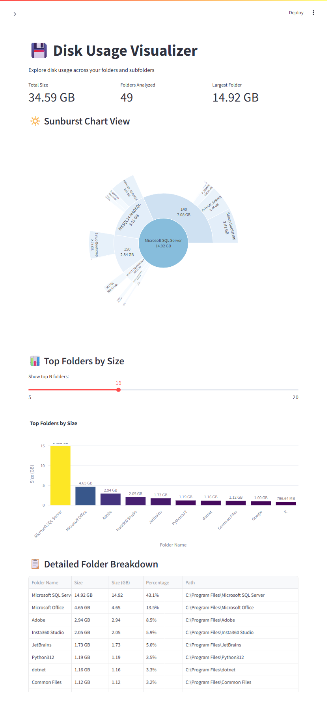

# 💾 Disk Usage Visualizer

A small, cross-platform tool to analyze and visualize folder and disk usage.

This project contains two complementary interfaces:

- `main.py` — Streamlit web app for interactive exploration and visualization.
- `disk_usage_standalone.py` — lightweight CLI/GUI runner that generates
	HTML and JSON reports (Plotly charts are optional).

<a href="demo.png"></a>

Key features
------------

- Recursive folder-size analysis with configurable depth
- Interactive Sunburst (hierarchical) and Bar charts
- Human-readable size formatting (B, KB, MB, GB, TB)
- Exportable JSON and HTML reports
- Streamlit UI for quick exploration and drill-down
- Standalone CLI/GUI mode (Tkinter) for environments without Streamlit

Requirements
------------

- Python 3.8+
- `streamlit` (for the Streamlit app)
- `plotly` (required for interactive charts; optional for standalone mode)

Installation
------------

Clone and install runtime dependencies:

```bash
git clone <repo-url>
cd disk_usage_visualizer
pip install -r requirements.txt
```

Running the Streamlit app
-------------------------

```bash
streamlit run main.py
```

The app will open in your browser (usually at `http://localhost:8501`).

Running the standalone tool
---------------------------

- GUI mode:

```bash
python disk_usage_standalone.py --gui
```

- CLI mode:

```bash
python disk_usage_standalone.py "C:\\path\\to\\folder" 2
```

(Second argument is optional depth.)

Outputs
-------

- `disk_usage_report.html` — styled HTML report
- `disk_usage_report.json` — machine-readable JSON summary
- `disk_usage_sunburst.html` — interactive Plotly sunburst (if Plotly is installed)

Notes and troubleshooting
-------------------------

- Large folders or entire drives may take time to analyze; start with subfolders for speed.
- Permission-restricted folders are skipped; run with elevated privileges if needed.
- If Plotly charts are not generated, install Plotly:

```bash
pip install plotly
```

Contributing
------------

Contributions and bug reports are welcome. Please open an issue or a pull request with a clear description.

License
-------

This project is provided under the MIT License. See `LICENSE` if included.

Happy analyzing! 🎉
